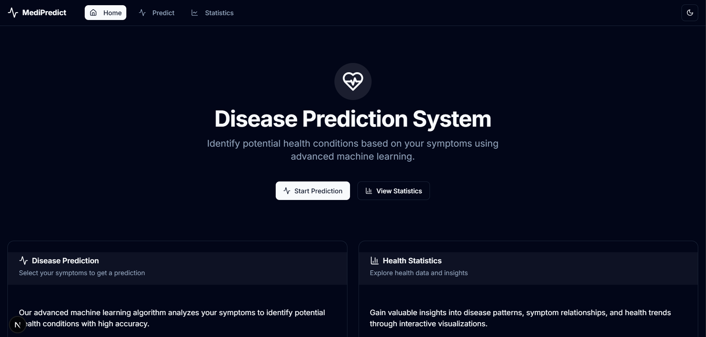

# Disease Predictor

A web application that predicts potential diseases based on user-selected symptoms using machine learning and provides AI-generated explanations for the predictions. This project combines a robust backend with a modern, responsive frontend to deliver an intuitive user experience for health-related insights.



## Table of Contents

- [Installation](#installation)
- [Usage](#usage)
- [Features](#features)
- [Technologies Used](#technologies-used)
- [Dataset Information](#dataset-information)
- [API Endpoints](#api-endpoints)
- [Contributing Guidelines](#contributing-guidelines)
- [License](#license)
- [Additional Notes](#additional-notes)

## Installation

Follow these steps to set up the Disease Predictor project on your local machine. The project has two main components: the backend (Python-based) and the frontend (Node.js-based).

### Prerequisites

Before you begin, ensure you have the following installed:

- **Python 3.x**: For the backend server and machine learning components.
- **Node.js 14+**: For the frontend development server.
- **pip**: Python package manager.
- **npm**: Node package manager.

### Backend Setup

1. Navigate to the backend directory:

    ```bash
    cd backend
    ```

2. Install the required Python dependencies:

    ```bash
    pip install flask pandas numpy scikit-learn flask-cors
    ```

3. Ensure the `Training.csv` dataset file is placed in the backend directory [(see Dataset Information for details)](#dataset-information).

### Frontend Setup

1. Navigate to the `disease-predictor` directory:

    ```bash
    cd disease-predictor
    ```

2. Install the required Node.js dependencies:

    ```bash
    npm install
    ```

3. Set up the Gemini API key as an environment variable for AI explanations:

    ```ts
    //.env. Create a new .env file and Put your Gemini Api Key 
    GEMINI_API_KEY=Your_Gemini_API_Key
    ```

4. Verify that the API endpoint in your frontend code (e.g., in a config file or API client) points to the backend server at <http://localhost:5000>. Adjust this if you’re running the backend on a different port or host.

## Usage

Once installed, follow these steps to run and use the application:

1. Start the Backend Server:

    - From the `backend` directory, run:

    ```bash
    python app.py
    ```

    - The backend will start on <http://localhost:5000> by default.

2. Start the Frontend Server:

    - From the `disease-predictor` directory, run:

    ```bash
    npm run dev
    ```

    - The frontend will start on <http://localhost:3000> by default.

3. Interact with the Application:

    - Open your web browser and go to <http://localhost:3000>.
    - Use the autocomplete dropdown to select symptoms you’re experiencing.
    - Click the "Predict Disease" button to see the predicted disease based on your input.
    - Click "Research about it" to view an AI-generated explanation of the predicted disease.

**Note**: Ensure both servers are running simultaneously for full functionality. The application works best in modern browsers like Chrome, Firefox, or Edge. There are no specific browser requirements beyond JavaScript support.

## Features

The Disease Predictor offers the following key features:

- **Symptom Selection**: An intuitive autocomplete dropdown to easily select symptoms.
- **Disease Prediction**: Powered by a RandomForestClassifier trained on symptom-disease data.
- **AI Explanations**: Brief, AI-generated overviews of predicted diseases using Hugging Face’s inference API.
- **Responsive Design**: A modern, mobile-friendly interface built with ShadCN UI and TailwindCSS.

## Technologies Used

The project leverages a variety of tools and frameworks, categorized by component:

- **Backend**:
  - **Flask**: Lightweight web framework for Python.
  - **scikit-learn**: Machine learning library for training the RandomForestClassifier.
  - **pandas**: Data manipulation and analysis.
  - **numpy**: Numerical computing for data processing.
  - **flask-cors**: Enables Cross-Origin Resource Sharing for API requests.

- **Frontend**:
  - **Next.js**: React framework for server-side rendering and static site generation.
  - **Gemini API**: API for generating AI-based disease explanations.
  - **TypeScript**: Adds static typing to JavaScript for better code reliability.
  - **ShadCN UI**: Component library for a polished user interface.
  - **TailwindCSS**: Utility-first CSS framework for responsive design.

## Dataset Information

The project uses a dataset named `Training.csv` to train its machine learning model. Key details:

- **Structure**:
  - Columns represent various symptoms (binary values: `0` for absent, `1` for present).
  - A `prognosis` column contains the corresponding disease names.
- **Purpose**: Used to train the RandomForestClassifier for predicting diseases based on symptom combinations.
- **Location**: Place this file in the backend directory before running the application.

If your dataset comes from a specific source, feel free to add a line here (e.g., "Sourced from [Kaggle](https://www.kaggle.com/)").

## API Endpoints

The backend exposes the following API endpoints:

- **GET /symptoms**:
  - **Purpose**: Retrieve the list of available symptoms for the frontend dropdown.
  - **Response**: JSON array of symptom names (e.g., `["fever", "cough", ...]`).

- **POST /predict**:
  - **Purpose**: Submit selected symptoms and receive a predicted disease.
  - **Request Body**: JSON object with selected symptoms (e.g., `{"symptoms": ["fever", "cough"]}`).
  - **Response**: JSON object with the predicted disease and explanation (e.g., `{"disease": "Flu", "explanation": "AI-generated text..."}`).

**Note**: Ensure the frontend is configured to communicate with these endpoints at <http://localhost:5000>.

## Contributing Guidelines

We welcome contributions from the community! To get involved:

- **Report Issues**: Use the GitHub issue tracker to report bugs or suggest features.
- **Submit Pull Requests**: Fork the repository, make your changes, and submit a pull request with a clear description of your updates.
- **Coding Standards**: Follow the existing code style and run any linting tools (e.g., ESLint for frontend, flake8 for backend) before submitting.

For questions, reach out via the issue tracker or repository discussions.

## License

This project is licensed under the MIT License. See the LICENSE file in the repository for full details.

## Additional Notes

- **Credits**: Special thanks to anyone who contributed ideas, code, or feedback.
- **Related Resources**: For more information, explore related tools like Hugging Face or scikit-learn documentation.
